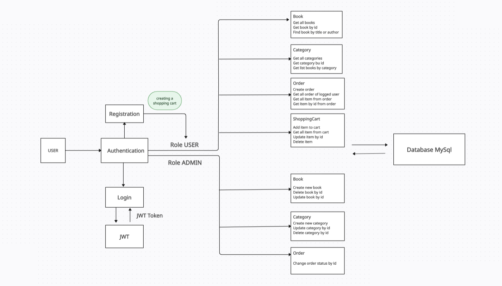

# Bookstore API 📚
Welcome to the Online Bookstore API, a RESTful API designed for managing an online bookstore. It allows users to manage a catalog of books, shopping carts, and orders, and supports user registration and authentication via JWT. The API also includes role-based access control, enabling different levels of access for users and administrators.
## Technologies
- **Java 17**: Core programming language for backend development.
- **Spring Boot**: Framework for building microservices with minimal configuration.
- **Spring Web**: Module for building REST APIs and handling HTTP requests.
- **Spring Security**: Authentication and authorization framework.
- **MapStruct**: Simplifies object mapping between DTOs and entities.
- **Liquibase**: Tool for managing database schema migrations.
- **JUnit & MockMvc**: Frameworks for unit and integration testing.
- **Docker**: Containerization platform for consistent development and deployment environments.
## Features
### Users 👥
- User registration and login.
- JWT-based authentication.
- User roles: USER (regular user) and ADMIN (administrator).
- Administrators can add, update, and delete books and categories.
### Books 📚 
- CRUD operations for books: create, read, update, and delete.
- Filter books by categories.
- Search books by title or author.
### Shopping Cart 🛒
- Add books to the cart (authenticated users only).
- View cart contents.
- Update book quantities in the cart.
- Remove books from the cart.
### Orders 📋
- Place orders from the cart.
- View order history (authenticated users only).
- Administrators can view all orders and change the order status.
## Getting Started 🚀
### Setup
1. **Clone the repository:**
```
git clone https://github.com/vladshender/Online-Book-Store.git
```
2. **Build the project:**
```
mvn clean package
```
3. **Start the application using Docker Compose:**
```
docker-compose up
```
### Connecting to a Custom Database 🗄
To connect to a custom MySQL database, update the application.properties file with your database details:
```
spring.datasource.url=jdbc:mysql://<YOUR_DB_HOST>:<YOUR_DB_PORT>/<YOUR_DB_NAME>
spring.datasource.username=<YOUR_DB_USERNAME>
spring.datasource.password=<YOUR_DB_PASSWORD>
spring.datasource.driver-class-name=com.mysql.cj.jdbc.Driver
spring.jpa.hibernate.ddl-auto=validate
spring.jpa.show-sql=true
server.servlet.context-path=/api

jwt.expiration=<TIME_SESSION_EXPERATION_IN_MS>
jwt.secret=<SECRET_WORD>
```
## Scheme of main interactions and functions in the project 

##
The Bookshop API provides a robust foundation for managing users, books, categories, and orders in an online bookstore. The technology stack provides scalability, security and ease of maintenance. Feel free to contribute or provide feedback to help us improve.
##
| Method          | Endpoint   |          Role         |     Description                         |           |       |
|-----------------|------------|-----------------------|-----------------------------------------|-----------|-------|
|  `GET`          | `/books`       | USER               |   Get all book                          |           |        |
| `GET`         | `/books/{id}`     | USER             |    Get book by id                         |           |        |
| `POST`        | `/books`         | ADMIN             |    Сreate a new book                     |           |        |
| `DELETE`      | `/books/{id}`     | ADMIN            |     Delete a book by id                  |           |        |
| `PUT`         |  `/books/{id}`    | ADMIN            |     Update book by id                    |           |        |
| `GET`         | `/books/search`   | USER              |   Search for a book by title or author  |           |        |

